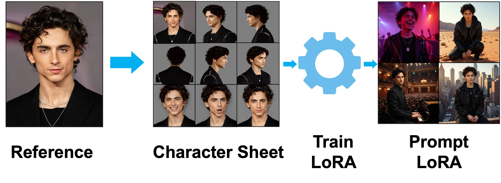

# AI-Powered Character LoRA Creation

CharForge is a powerful, automated pipeline for creating high-quality character LoRAs (Low-Rank Adaptations) for Stable Diffusion. It streamlines the entire process, from generating a character sheet to training the LoRA, making it easy to bring your characters to life.

<div style="display: flex; gap: 1px; align-items: flex-start;">
  
  
</div>

## Features

*   **Character Sheet Generation**: Generate a diverse character sheet from a _single reference image_
*   **Automatic Captioning**: Generate detailed captions for training images using Google GenAI.
*   **LoRA Training**: Train high-quality character LoRAs
*   **Easy Inference**: Generate images of your character in various scenarios

<div style="text-align: center;">
  
</div>

## Examples

<div style="text-align: center;">
  
</div>

## Installation

### 🌟 **NEW: RunPod Cloud Deployment**

Deploy CharForgex as a scalable cloud service with RunPod:

```bash
# Quick deployment to RunPod
cd runpod_worker
./setup_runpod.sh
python deploy_to_runpod.py --registry your-registry.com/username
```

**Benefits:**
- ✅ **No Local GPU Required** - Use powerful cloud GPUs
- ✅ **Automatic Scaling** - Pay only for what you use
- ✅ **Persistent Storage** - LoRAs and datasets survive restarts
- ✅ **Web GUI Included** - Easy-to-use interface
- ✅ **API Access** - Integrate with your applications

👉 **[Complete RunPod Deployment Guide](runpod_worker/RUNPOD_DEPLOYMENT.md)**

---

### 🖥️ **Local Installation**

### Prerequisites
*   Python 3.10 or higher
*   GPU with at least 48GB VRAM
*   At least 60GB RAM
*   At least 100GB of free disk space

### Setup

1. Clone and enter directory:
    ```bash
    git clone https://github.com/your-username/CharForgex
    cd CharForgex
    ```

2.  Set these API keys and variables in your `.env` and add funds where appropriate:
    ```bash
    HF_TOKEN=your_huggingface_token
    HF_HOME=/path/to/huggingface/cache
    CIVITAI_API_KEY=your_civitai_key
    GOOGLE_API_KEY=your_google_genai_key
    FAL_KEY=your_fal_ai_key
    ```

3.  Log into Hugging Face and accept their terms of service to download [Flux.1-dev](https://huggingface.co/black-forest-labs/FLUX.1-dev)

4.  Run the setup script:
    ```bash
    bash setup.sh
    ```

    This will:
    - Install submodules including [ComfyUI](https://github.com/RishiDesai/ComfyUI.git), all required ComfyUI custom nodes, [LoRACaptioner](https://github.com/RishiDesai/LoRACaptioner.git), [MVAdapter](https://github.com/RishiDesai/MV-Adapter.git), and [ai-toolkit](https://github.com/ostris/ai-toolkit.git).
    - <details>
        <summary>Show all ComfyUI custom nodes</summary>

        - comfyui_essentials
        - comfyui-advancedliveportrait
        - comfyui-ic-light
        - comfyui-impact-pack
        - comfyui-custom-scripts
        - rgthree-comfy
        - comfyui-easy-use
        - comfyui-impact-subpack
        - was-node-suite-comfyui
        - ComfyUI_UltimateSDUpscale
        - ComfyUI-PuLID-Flux-Enhanced
        - comfy-image-saver
        - ComfyUI-Image-Filters
        - ComfyUI-Detail-Daemon
        - ComfyUI-KJNodes
        </details>
    - Download all necessary models to `HF_HOME`
    - Set up the character sheet generation pipeline

5.  Activate venv:
    `source .venv/bin/activate`

## Usage

### 🌐 **RunPod Cloud Usage**

If you deployed to RunPod, use the web GUI or Python client:

```python
# Python client example
from runpod_worker.client_example import CharForgexClient

client = CharForgexClient("your_endpoint_id", "your_api_key")

# Train a character
client.train_character("my_character", "reference.jpg")

# Generate images
images = client.generate_images("my_character", "portrait, detailed face")
```

**Web GUI**: Access at your RunPod endpoint URL + `:8000`

---

### 🖥️ **Local Usage**

### 1. Train a Character LoRA

```bash
python train_character.py --name "character_name" --input "path/to/reference_image.png"
```

<details>
<summary>Show all training options</summary>

```bash
python train_character.py \
  --name "character_name" \
  --input "path/to/reference_image.png" \
  [--work_dir WORK_DIR] \
  [--steps STEPS] \
  [--batch_size BATCH_SIZE] \
  [--lr LEARNING_RATE] \
  [--train_dim TRAIN_DIM] \
  [--rank_dim RANK_DIM] \
  [--pulidflux_images PULID_FLUX_IMAGES]
```

- `--name` (str): Character name (used for folder and model naming)
- `--input` (str): Path to input image
- `--work_dir` (str, optional): Working directory (defaults to `./scratch/{name}/`)
- `--steps` (int, optional): Number of training steps (default: 800)
- `--batch_size` (int, optional): Training batch size (default: 1)
- `--lr` (float, optional): Learning rate (default: 8e-4)
- `--train_dim` (int, optional): Training image dimension (default: 512)
- `--rank_dim` (int, optional): LoRA rank dimension (default: 8)
- `--pulidflux_images` (int, optional): Number of Pulid-Flux images to include (default: 0)

</details>

This command will:
1.  Generate a character sheet from your input image
2.  Caption the generated images
3.  Train a [LoRA](https://arxiv.org/abs/2106.09685) on [Flux.1-dev](https://huggingface.co/black-forest-labs/FLUX.1-dev) using the generated dataset

### 2. Generate Images with Your Character LoRA

```bash
python test_character.py --character_name "character_name" --prompt "A detailed prompt here"
```

<details>
<summary>Show all inference options</summary>

```bash
python test_character.py \
  --character_name "character_name" \
  --prompt "A detailed prompt here" \
  [--work_dir WORK_DIR] \
  [--lora_weight LORA_WEIGHT] \
  [--test_dim TEST_DIM] \
  [--do_optimize_prompt/--no_optimize_prompt] \
  [--output_filenames FILE1 FILE2 ...] \
  [--batch_size BATCH_SIZE] \
  [--num_inference_steps STEPS] \
  [--fix_outfit/--no_fix_outfit] \
  [--safety_check/--no_safety_check] \
  [--face_enhance/--no_face_enhance]
```

- `--character_name` (str): Name of the character (used to find LoRA and work_dir)
- `--prompt` (str): The prompt to use for generation
- `--work_dir` (str, optional): Working directory (defaults to `./scratch/{character_name}/`)
- `--lora_weight` (float, optional): LoRA strength (default: 0.73)
- `--test_dim` (int, optional): Image width/height (default: 1024)
- `--do_optimize_prompt` / `--no_optimize_prompt`: Whether to optimize the prompt using LoRACaptioner (default: enabled)
- `--output_filenames` (str, optional): Filenames for output images (space separated list)
- `--batch_size` (int, optional): Number of images to generate (default: 4)
- `--num_inference_steps` (int, optional): Steps for generation (default: 30)
- `--fix_outfit` / `--no_fix_outfit`: Use the reference image flag in prompt optimization (default: disabled)
- `--safety_check` / `--no_safety_check`: Run safety checks on generated images (default: enabled)
- `--face_enhance` / `--no_face_enhance`: Enable or disable face enhancement (default: disabled)

</details>

This command will:
1.  Load your LoRA, prompt it, and generate the image(s)
2.  Optionally do prompt optimization, [FaceEnhance](https://github.com/RishiDesai/FaceEnhance) outputs, and run a safety check.

Note: The first run of `train_character.py` and `test_character.py` will take longer as remaining models will be downloaded.

## Implementation Details

- The training script runs a [ComfyUI](https://github.com/comfyanonymous/ComfyUI) server ephemerally.
- All character images and character data are saved in `./scratch/{character_name}` for easy access and organization.
- [fal.ai](https://fal.ai/) is used for upscaling and generating [PuLID-Flux](https://github.com/ToTheBeginning/PuLID) images. 
- **Google GenAI** (`gemini-2.5-flash`) is used for image captioning and prompt optimization (via [LoRACaptioner](https://github.com/RishiDesai/LoRACaptioner.git)) and for generating prompts for PuLID-Flux.
- The character sheet generation is partly based off [Mickmumpitz's](https://x.com/mickmumpitz) Flux character consistency workflow. Specifically upscaling images, facial expressions, and lighting conditions. 
- Sections of the workflow were broken up into modular pieces. I used the [ComfyUI-to-Python-Extension](https://github.com/pydn/ComfyUI-to-Python-Extension) to re-engineer components for efficiency and function.

#### Training and Inference

- The character sheet includes multi-view images, varied facial expressions, lighting conditions, and (optionally) PuLID-Flux images. 
- Images are autocaptioned using [LoRACaptioner](https://github.com/RishiDesai/LoRACaptioner).
- LoRA is trained using [ai-toolkit](https://github.com/ostris/ai-toolkit).
- Inference is handled by [diffusers](https://huggingface.co/docs/diffusers/en/index) with some speed improvements from the [Modal Flux inference guide](https://modal.com/docs/examples/flux).

#### Hyperparameters
- Training: LoRA rank of 8 and resolution fixed to 512x512 is the right balance of quality and speed.
   - Entire training pipeline takes 30-40 minutes on 1 L40S
- Inference: Resolution of 1024x1024 and LoRA weight of 0.65-0.85 gives the best results.
   - Batch size of 4 takes 60 seconds on 1 L40S if the models are loaded in memory, 120 seconds otherwise.
   - If FaceEnhance is enabled, you will likely need more than 48GB VRAM.

#### Advanced Usage

- **Training Parameters**: You can modify training parameters by passing the relevant CLI arguments to `train_character.py`, or by editing the YAML config [`scripts/character_lora.yaml`](scripts/character_lora.yaml).
- **Public LoRA Serving**: Use [`python scripts/serve_lora.py`](scripts/serve_lora.py) to serve LoRA weights via a FastAPI server, making them publicly accessible (e.g., for fal.ai inference).
- **Run ComfyUI Server**: Use [`python scripts/run_comfy.py`](scripts/run_comfy.py) to launch a ComfyUI server, useful for doing inference manually.
- **Symlink LoRAs for ComfyUI**: Use [`bash scripts/symlink_loras.sh`](scripts/symlink_loras.sh) to symlink trained LoRA weights from `scratch/{character_name}/` to the ComfyUI LoRA directory for easy access.
# CharForget
